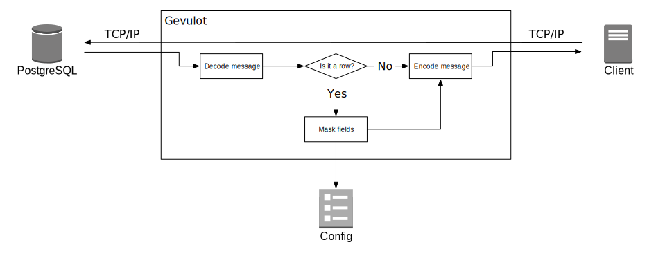
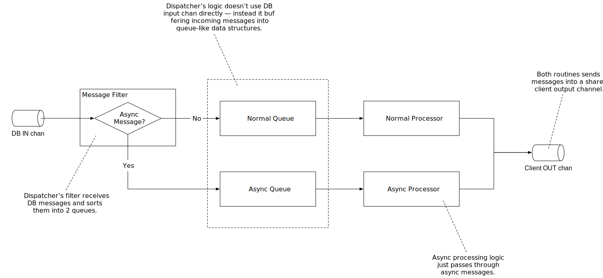

# Gevulot — a PostgreSQL proxy for masking sensitive data


> Gvulot (Hebrew: גְּבוּלוֹת, lit. "Borders")

Gevulot is a TCP proxy that sits between your PostgreSQL database and client and proxies data back and forth.
It listens to all messages sent from database to the client and provides a mechanism for users to modify data in-transit and before received by the client. The main purpose of Gevulot is to mask personally identifiable information sent to clients.



## Usage

To start the Gevulot:

```bash
gevulot
```

(by default it will load `gevulot.toml` from the current directory)

If you need to specify config path:

```bash
gevulot --config=/path/to/config.toml
```

For help:

```bash
gevulot --help
```

## Architecture

CSP view:


### Dispatcher

Dispatcher is responsible for processing messages from a database to a client and vice versa. 
PostgreSQL protocol has deterministic message flow except when it doesn't :(

Following messages can arrive at any time:

* NoticeResponse
* ParameterStatus
* NotificationResponse

To simplify the logic we use 2 parallel processing routines: one handles normal deterministic flow and
another one — async out-of-order flow.



## Configuration File Reference

Gevolut uses [TOML](https://github.com/toml-lang/toml) format for its config.

Here is an example:

```toml
listen = "0.0.0.0:4242"
database-url = "postgres://localhost/hired_dev"
```

### The `listen` field (mandatory)

Sets local address and port on which Gevolut will listen for client connections.

**NB:** UNIX sockets are not supported yet.

Example: `listen = "0.0.0.0:4242"`

### The `database-url` field (mandatory)

Sets [URL](https://godoc.org/github.com/lib/pq#hdr-Connection_String_Parameters) to use to connect to the database. Gevulot requires access to the proxied database to load metadata (i.e., OID mapping).

**NB:** If a client attempt to connect to a different database than specified here, the proxy will return an error.

Example: `database-url = "postgres://localhost/hired_dev"`
